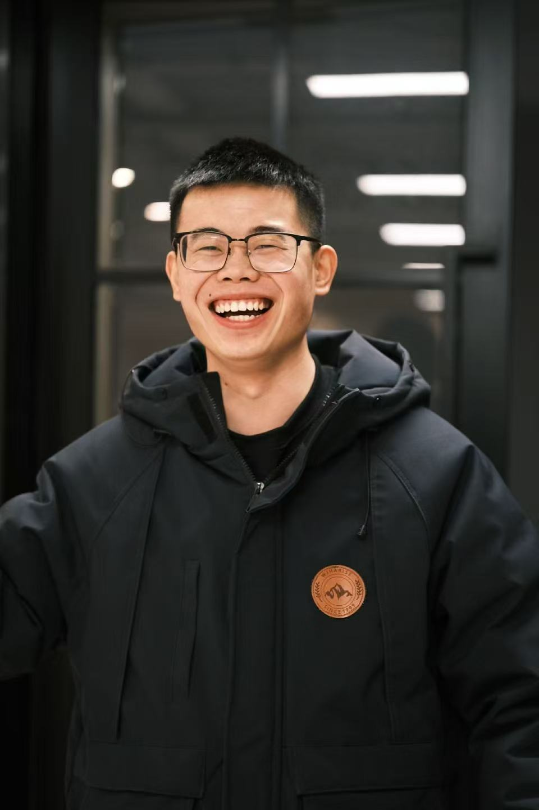

<table style="border: none; border-collapse: collapse; margin-bottom: 20px;">
  <tr>
      <td valign="middle" style="border: none;">       
        &nbsp;
    </td>
        <td align="left" valign="middle" style="font-family:JetBrains Mono; font-size: 14px; border: none; padding-left: 15px;">
      <h1 style="margin-top: 0; margin-bottom: 0; text-align: center; font-family:JetBrains Mono; border-bottom: 2px solid #ccc; margin-top: 10px; padding-bottom: 5px;">Chunsheng Zuo (左春生) </a></h1>
       
      

        I am an undergraduate student majoring in automation at the School of Robotics, Beijing Union University. 
        I am a continuous learner and explorer, and am passionate about participating in open-source projects related to embodied intelligence and grand prognostic models. 
        My open source and academic interests are listed below. 
        If you are interested in my experience and have anything or questions to discuss, please feel free to contact me.
      

      

        &nbsp; &nbsp;
        
      

    </td>
  </tr>
</table>

<table style="border: none; border-collapse: collapse; margin-bottom: 20px;">
  <tr>
    <td align="left" valign="top" style="font-family:JetBrains Mono; font-size: 14px; border: none; padding: 8px;">
            <h1 style="margin-top: 0; margin-bottom: 0; font-family:JetBrains Mono; border-bottom: 2px solid #ccc; padding-bottom: 5px;">Research Interest</h1>
      <li>Audio Codec Model (Audio Tokenizer)</li>
    </td>
  </tr>
</table>

<table style="border: none; border-collapse: collapse; margin-bottom: 20px;">
  <tr>
    <td align="left" valign="top" style="font-family:JetBrains Mono; font-size: 14px; border: none; padding: 8px;">
            <h1 style="margin-top: 0; margin-bottom: 0; font-family:JetBrains Mono; border-bottom: 2px solid #ccc; padding-bottom: 5px;">Honors and Awards</h1>
      <li>2024, Stars of Tomorrow, Microsoft Research Asia.</li>
    </td>
  </tr>
</table>

  Updating time: 2025.5.13

